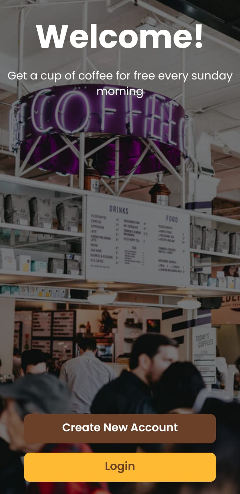
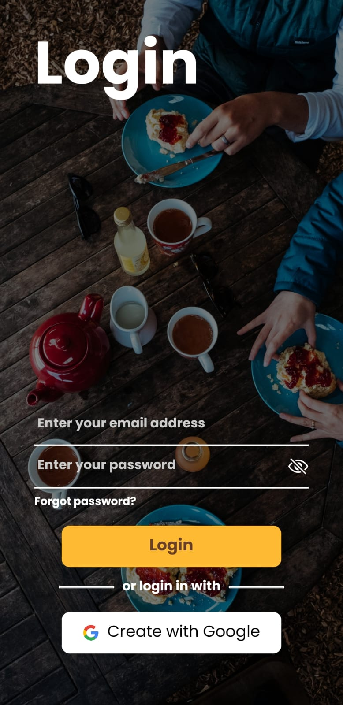
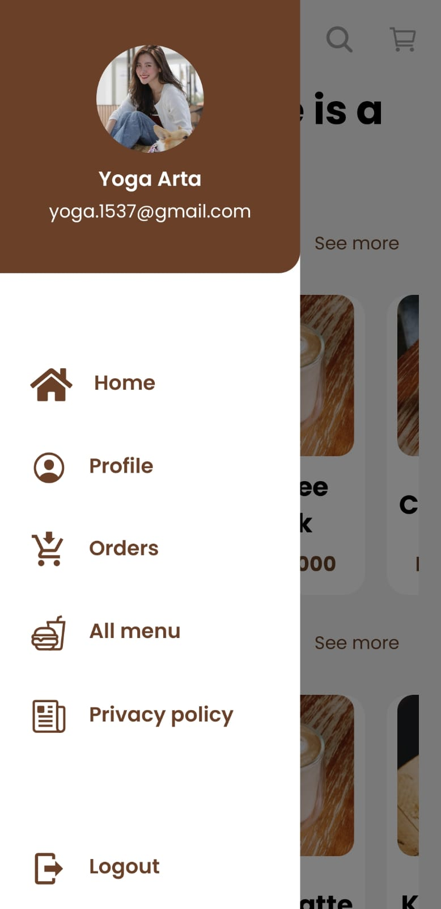
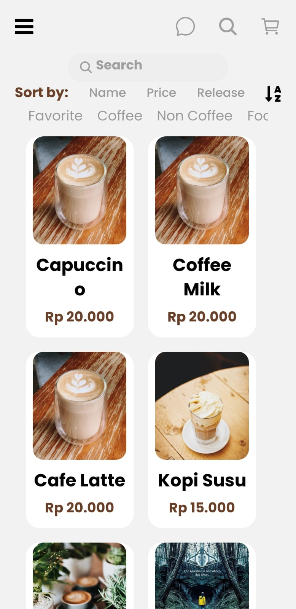
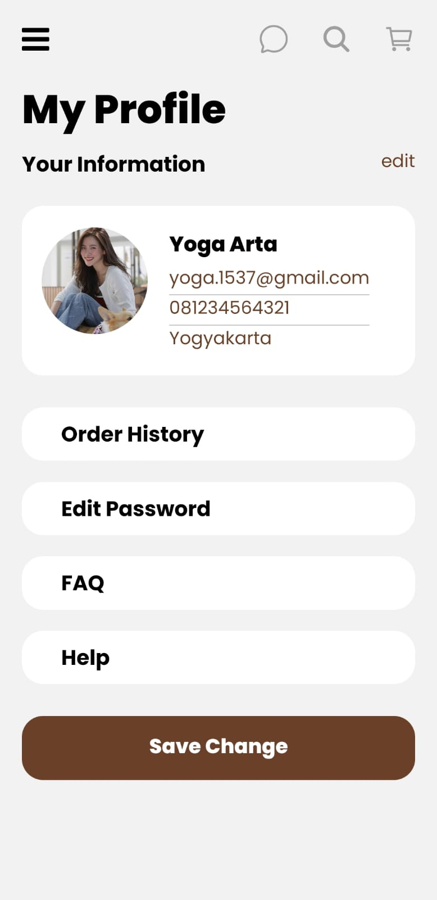

<p align="center">

  <h1 align="center">Gargyo Coffee Mobile App</h1>

  <p align="center">
    <br />
    <a href="#">View Live Application</a>
    ·
    <a href="#">Report Bug</a>
    ·
    <a href="#">Request Feature</a>
  </p>
</p>

## Table of Contents

- [About the Project](#about-the-project)
  - [Built With](#built-with)
- [Getting Started](#getting-started)
  - [Prerequisites](#prerequisites)
  - [Installation](#installation)
- [Related Project](#related-project)

## About The Project

Gargyo Coffee is an online coffee shop

### Built With

[](https://reactnative.dev/)
[](https://reactjs.org/)
[](https://redux.js.org/)
<br>

## Getting Started

### Installation

1. Setting up the development environment from this [guide](https://reactnative.dev/docs/environment-setup)

2. Clone the repo

```sh
$ git clone https://github.com/yogaarta/gargyo-coffee-react-native.git
```

3. Install NPM packages

```sh
$ npm install
```

4. Add .env file at root folder project, and add following

```sh
REACT_APP_BE_HOST="<YOUR BACKEND HOST>"
```


5. Running Metro

```sh
$ npx react-native start
```
6. Building Android

```sh
$ npx react-native run-android
```

7. Gargyo Coffee Mobile App App is Running

### Preview

<div style="display:flex, flex-direction: column" >





<br>





</div>

### Build Apk

- [`Gargyo Coffee Mobile App`](https://drive.google.com/drive/u/0/folders/1ji1Q0aayTOOIIaDPOHXDLsPOQ2Xw14BZ)

### Related Project

- [`Backend-Gargyo-Coffee`](https://github.com/zilgya/zilgya-server)